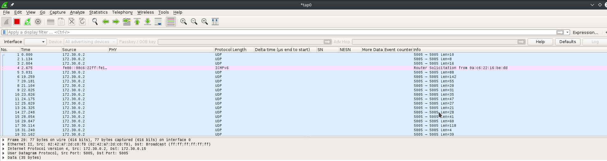
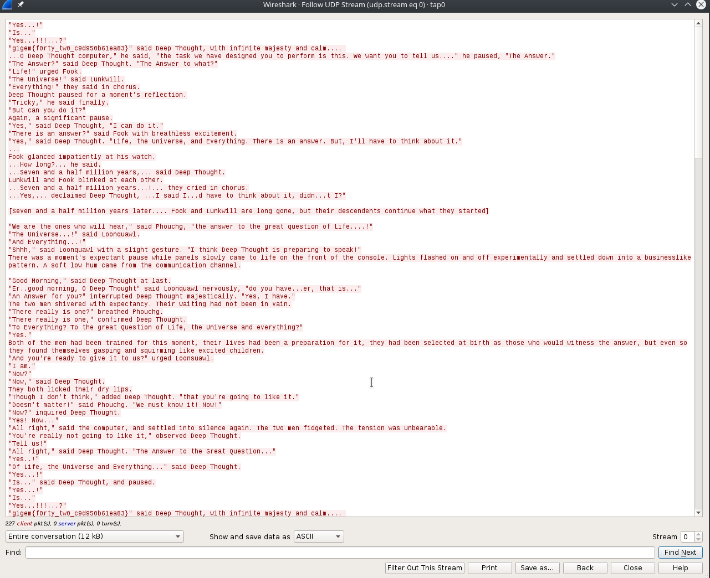

## Stop and Listen - Network/Pentest

**Description:** Sometimes you just need to stop and listen.
This challenge is an introduction to our network exploit challenges, which are hosted over OpenVPN.
**Challenge:** : listen.openvpn
**Difficulty:** easy
**Solved by:** Neolex  

**Solution:**  
This challenge gives us a openvpn script to connect to their network.
Let's connect to the vpn with openvpn : ```sudo openvpn --config listen.ovpn ```
Now the challenge name tell us to listen so I use wireshark to see if there was some traffic on the network :
we can see some UDP traffic : 

Let's follow the UDP stream : 

 
 Here is the flag ! 
 
**Flag:**  
gigem{f0rty_tw0_c9d950b61ea83}

